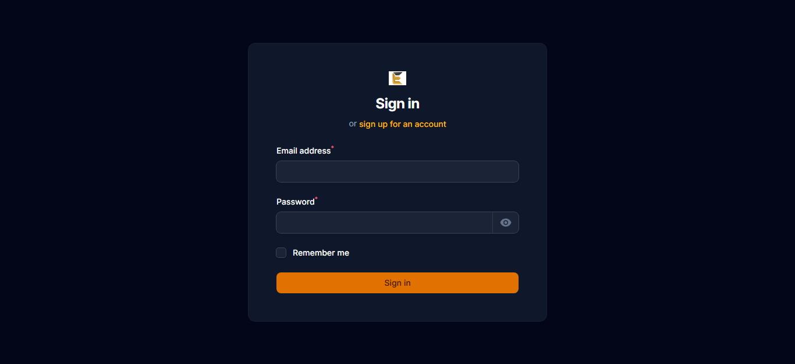
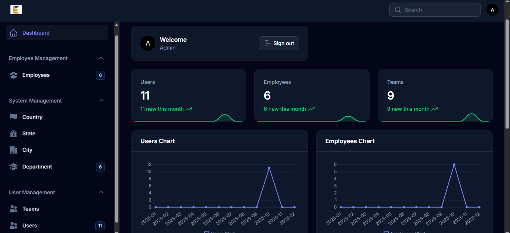
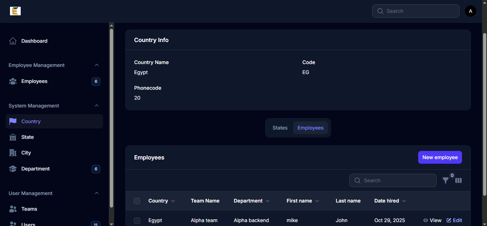
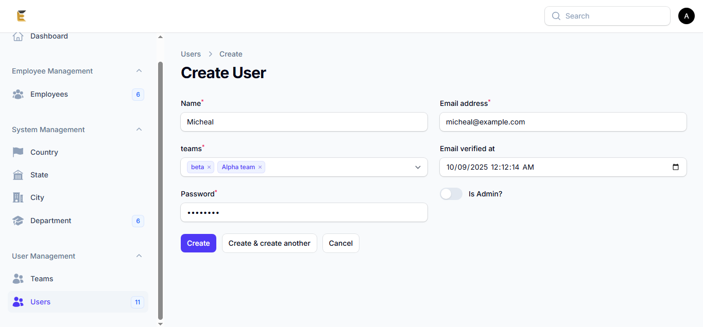
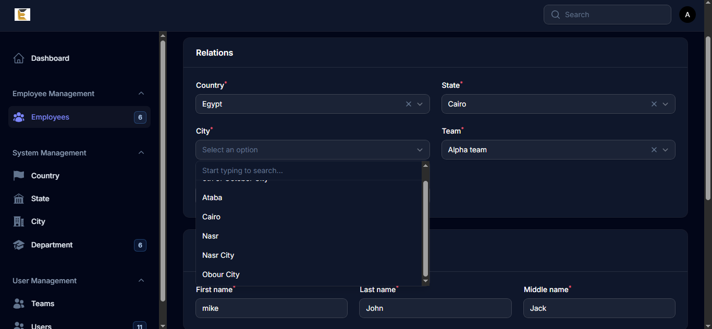
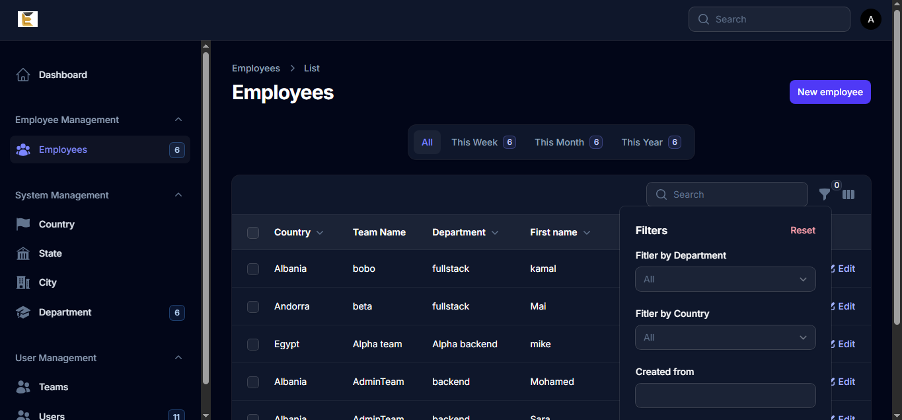

# Multitenant-AdminApp

Multitenant-AdminApp is a professional multi-tenant dashboard application built with Laravel 12 and Filament v4. It features a comprehensive admin panel and a separate app panel, allowing centralized management of countries, states, cities, departments, employees, and users. The system supports multi-tenancy, where admins can create teams, assign users, and manage team-specific resources. Advanced dashboards provide insightful statistics and charts for employees, departments, and users. Each resource includes search functionality and relational management for efficient data handling.
---

## Features

### Admin Panel
- Full CRUD for **Countries, States, Cities, Departments, Employees, Users**.
- Relation Managers for hierarchical resources:
  - City → State → Country  
  - Department → Team  
  - Employee → Country, State, City, Department, Team
- Ability to **create new teams** and assign users to existing teams.
- Assign `is_admin` role when creating users (true/false).
- **Dynamic dependent selects**:
  - Selecting a country filters available states.
  - Selecting a state filters available cities.
  - Auto-deletion of dependent records.
- **Navigation groups**:
  - System Management: Countries, States, Cities  
  - Employee Management: Employees  
  - User Management: Users
- **Dashboard Widgets**:
  - `StateAdminOverview` widget: employee & user statistics.
  - Employees chart (line) & latest employees table.
  - Users chart (line) & latest users table.
- **Global search** available on almost all resources.

### App Panel
- Default panel for team users.
- Team registration on first login.
- CRUD for **Employees & Departments** within the team.
- Team-specific dashboard widgets:
  - `StateAppOverview`: employee, user & department stats for the team.
  - Employees chart (line) & latest employees table.
- User profile management: update name, email, and password.
- Multi-tenant awareness:
  - Each team sees only their own employees and departments.
  - Admin sees all teams and resources.

---

## Relationships
| Model        | Relationship                          |
|--------------|---------------------------------------|
| Country      | hasMany States                        |
| State        | belongsTo Country, hasMany Cities     |
| City         | belongsTo State                        |
| Team         | hasMany Departments, belongsToMany Users |
| Department   | belongsTo Team, hasMany Employees     |
| Employee     | belongsTo Country, State, City, Department, Team |
| User         | belongsToMany Teams                    |

---

## Additional Features
- **Search** functionality in almost every resource.
- **Relation managers** for nested data.
- **Dynamic dependent select fields** for creating employees.
- **Seeder data** includes Admin user, All countries, states, and cities of the whole world and it's zip-code and phonecode

---

## Tech Stack
- **Backend:** Laravel 12, PHP 8.2
- **Frontend:** Vite, Tailwind CSS 4
- **Admin Panel:** Filament v4
- **Database:** MySQL
- **Authentication:** Filament authentication & multi-tenancy

---
## Screen Shots

---

## License
This project is licensed under the **MIT License**.

---

## Developed By
**Mohamed Elabyad**  
📧 Email: m.elabyad.work@gmail.com
